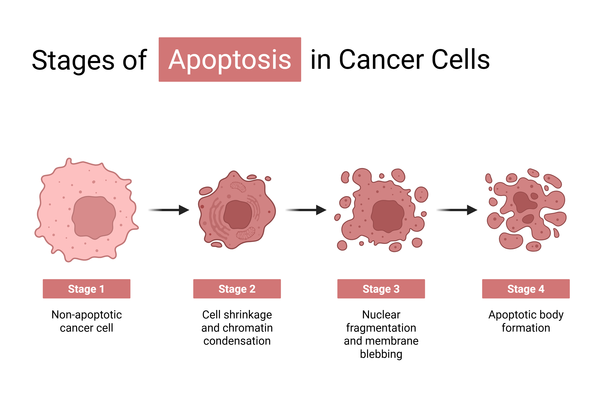
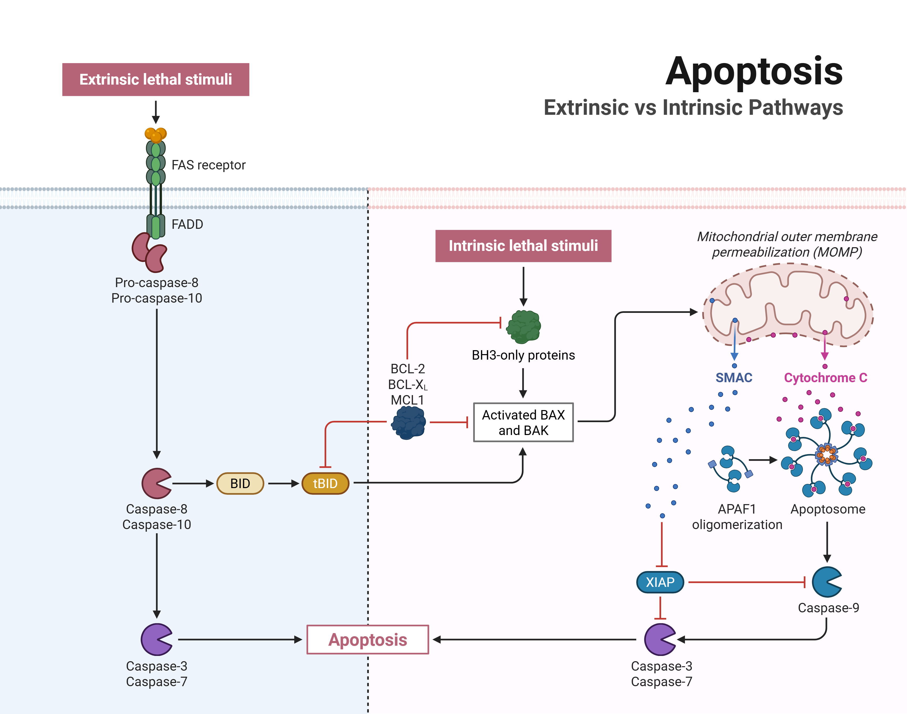

## Perspective

Apoptosis 是读癌症、治疗耐药和细胞死亡文献时绕不开的基础概念。它本来是维持发育和组织稳态的程序性细胞死亡方式；在癌症语境里，重点变成：癌细胞如何把这条死亡程序关掉，以及能不能用药物重新打开它。

先记住一个实用边界：**apoptosis 是最经典、临床转化最成熟的 regulated cell death；但癌症中的 cell death 不等于 apoptosis，necroptosis、pyroptosis、ferroptosis 等通路也会参与治疗反应和免疫效应。**

## Definition

Apoptosis is a regulated form of programmed cell death characterized by cellular shrinkage, chromatin condensation, membrane blebbing, DNA fragmentation, caspase activation, and usually rapid clearance by phagocytes through efferocytosis.

中文理解：apoptosis 是一种“有秩序的细胞自毁程序”。细胞不是直接破裂，而是被拆解成容易清除的状态，因此在体内通常不强烈引发炎症。它和 necroptosis、pyroptosis 这类 lytic inflammatory death 的区别，关键不只是分子通路不同，也包括死亡后给免疫系统留下的信号不同。

## Why It Matters

Apoptosis 对癌症重要，是因为它位于 tumor suppression 和 therapy response 的交界处。

正常情况下，oncogene activation、DNA damage、growth factor withdrawal、cytotoxic therapy 等压力都可以把异常细胞推向 apoptosis。癌细胞如果能上调 BCL-2、BCL-XL、MCL-1 等 anti-apoptotic proteins，或降低 BIM、PUMA、BAX、BAK 等 pro-apoptotic signals，就能在本该死亡时活下来。

治疗上，apoptosis 也是第一个被成功药物化的 cell death pathway。BH3 mimetics，尤其 BCL-2 inhibitor venetoclax，证明“解除癌细胞的死亡刹车”可以成为真实临床策略。不过这个成功主要在 CLL 和部分 AML 中成立，在多数实体瘤里远没有这么简单。

## Core Mechanism

Apoptosis 有两条经典入口，最后都汇入 caspase-mediated dismantling。

**Intrinsic / mitochondrial pathway**

这条通路由细胞内部压力触发，例如 DNA damage、oncogenic stress、营养或生长因子缺乏、化疗和放疗。核心控制点是 BCL-2 family 对 BAX/BAK 的调节。

- Anti-apoptotic proteins: BCL-2, BCL-XL, MCL-1, BCL-W, A1/BFL1
- Pro-apoptotic BH3-only proteins: BIM, PUMA, BID, NOXA, BAD, BIK, HRK
- Effector proteins: BAX, BAK, BOK

当 BH3-only proteins 中和 anti-apoptotic BCL-2 proteins 后，BAX/BAK 被释放并在 mitochondrial outer membrane 上成孔，导致 mitochondrial outer membrane permeabilization (MOMP)。MOMP 释放 cytochrome c 和 SMAC/DIABLO，进而激活 APAF-1/caspase-9/caspase-3/7 级联。

**Extrinsic / death receptor pathway**

这条通路由细胞外 death ligands 触发，例如 FASL、TNF、TRAIL，分别作用于 FAS、TNFR1、TRAILR1/2 等 death receptors。受体招募 FADD/TRADD，形成 death-inducing signaling complex (DISC)，激活 caspase-8，再激活 caspase-3/7。

在 type I cells 中，caspase-8 直接激活 executioner caspases 就足够诱导死亡；在 type II cells 中，还需要 caspase-8 切割 BID 形成 tBID，再接入 mitochondrial pathway 进行放大。

**Point of no return**

在癌症文献里，一个重要判断是：extensive MOMP 比 caspase activation 更接近 apoptosis 的 point of no return。也就是说，BAX/BAK 造成广泛线粒体外膜通透化后，细胞通常已经越过不可逆死亡阈值。

## Key Points

- Apoptosis 是经典 programmed cell death，通常被 efferocytosis 快速清除，因此低炎症。
- Intrinsic apoptosis 的核心是 BCL-2 family 控制 BAX/BAK 和 MOMP。
- Extrinsic apoptosis 的核心是 death receptors、FADD/TRADD、DISC 和 caspase-8。
- MOMP 后释放 cytochrome c，形成 apoptosome，并激活 caspase-9 和 caspase-3/7。
- BCL-2、BCL-XL、MCL-1 是癌细胞常用的 anti-apoptotic brakes。
- BIM、PUMA、BID 等 BH3-only proteins 是把细胞推向 apoptosis 的重要压力传感器。
- p53 可以通过转录调控 PUMA、NOXA、BAX 等基因促进 apoptosis，但 p53 的功能不止 apoptosis，还包括 cell-cycle arrest、senescence 和 DNA repair。
- MYC 既推动增殖，也会增加 apoptosis 倾向；癌变常需要同时获得增殖信号和死亡逃逸。
- BH3 mimetics 的逻辑是模拟 BH3-only proteins，解除 anti-apoptotic BCL-2 proteins 对 BAX/BAK 的抑制。
- Venetoclax 是 BCL-2 inhibitor，在 CLL 和部分 AML 中是 apoptosis-targeted therapy 的代表。
- 实体瘤常不依赖单一 anti-apoptotic protein，可能同时需要 BCL-XL、MCL-1 或其他 survival pathways，因此更难用单一 BH3 mimetic 处理。
- 大量 apoptosis 或清除失败时，细胞可发生 secondary necrosis，释放 inflammatory mediators。
- Apoptosis 与其他 cell death pathways 有交叉，例如 caspase-3/7 可切割 GSDME，可能把死亡结果推向 secondary necrosis / pyroptosis-like lytic death。

## Cancer Context

在癌症里，apoptosis 最常见的读法不是“细胞如何死”，而是“癌细胞为什么不死”。

一类情况是 tumorigenesis。正常细胞遇到 oncogenic stress 时会被 apoptosis 清除；如果 BCL-2 过表达或 pro-apoptotic signaling 被削弱，异常细胞就能存活并继续积累变化。经典例子是 BCL-2 过表达促进 lymphoma。

另一类情况是 therapy resistance。很多化疗、放疗和 targeted therapy 最终都需要通过 apoptosis 执行杀伤。如果癌细胞提高 anti-apoptotic threshold，即使上游 DNA damage 或 oncogene inhibition 已经发生，也可能不进入死亡程序。

但也要保留一个复杂性：阻断 apoptosis 本身不一定强致癌，常常需要和 MYC、v-ABL 等 oncogenic drivers 配合；而过量 apoptosis 也可能通过 tissue regeneration 和 apoptosis-induced proliferation 间接促癌。因此 apoptosis 在癌症中不是简单的“越多越好”或“越少越坏”，而取决于细胞类型、时间、组织环境和免疫清除。

## Related Concepts

- regulated cell death
- necroptosis
- pyroptosis
- ferroptosis
- immunogenic cell death
- efferocytosis
- BCL-2 family
- BH3 mimetic
- MOMP
- caspase
- p53
- MYC
- venetoclax
- therapy resistance

## In Papers

- [Cell Death in Cancer](../../literature/papers/conradCellDeathCancer2026/index.qmd)

## Note

读论文时要注意作者是在说 apoptosis 的哪一层证据：morphology、cleaved caspase-3/7、BAX/BAK activation、MOMP、Annexin V staining、DNA fragmentation，还是只是根据基因表达推断。不同证据层级不能完全等价。

对我来说，apoptosis 最有用的理解是一个“死亡阈值模型”：癌细胞不是不知道怎么死，而是通过 BCL-2 family、p53 loss、survival signaling 和 TME support 把死亡阈值抬高。治疗的难点，就是如何把这个阈值压低到癌细胞会死，同时不把正常细胞和免疫细胞一起推下去。
