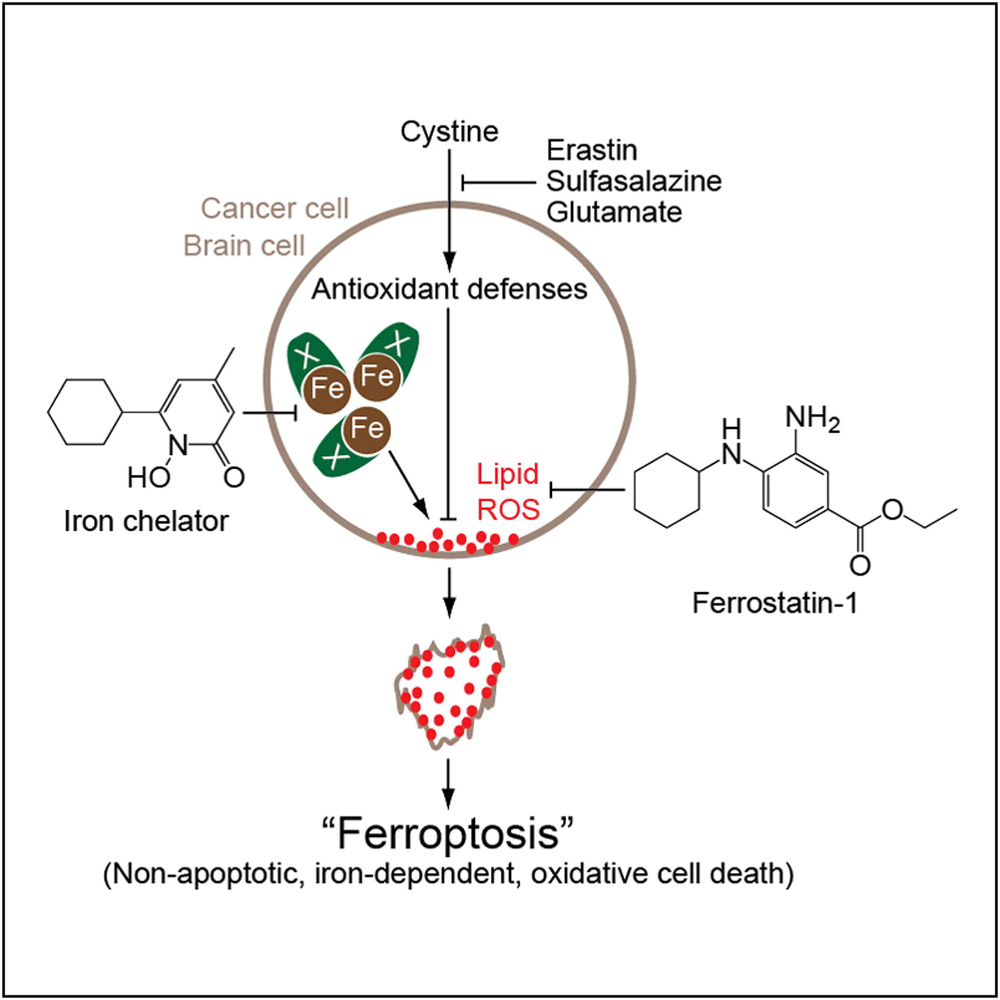
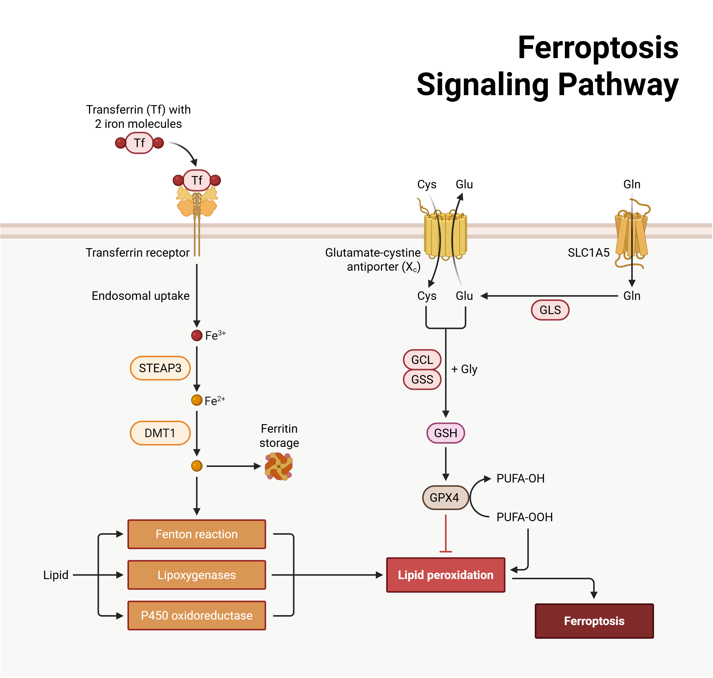
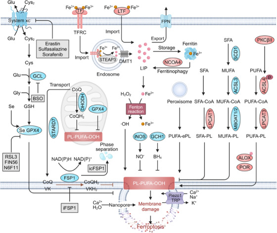

## Perspective

Ferroptosis，中文常译作铁死亡，是一种和 apoptosis、necroptosis、pyroptosis 很不一样的 regulated cell death。它不是由 death receptor、caspase 或 gasdermin 这类经典死亡信号直接启动，而是由铁依赖的脂质过氧化失控造成膜损伤。

先记住一个实用边界：**ferroptosis 是一种代谢型细胞死亡。核心问题不是“哪条受体通路被激活”，而是细胞能不能持续压住 PUFA-containing phospholipids 的过氧化。**

## Definition

Ferroptosis is an iron-dependent regulated cell death driven by chain-propagating phospholipid peroxidation, leading to membrane damage and loss of membrane integrity.

中文理解：铁死亡是“脂质氧化失控导致的死亡”。细胞膜里的多不饱和脂肪酸磷脂容易被氧化；铁促进自由基反应，让脂质过氧化不断放大。如果 GPX4、FSP1、GCH1/BH4 等防御系统压不住，膜结构最终崩溃，细胞死亡。

## Why It Matters

Ferroptosis 对癌症重要，是因为它切中了很多癌细胞的代谢代价。癌细胞为了增殖、转移、适应氧化压力和治疗压力，经常改变铁代谢、脂质组成、抗氧化系统和 redox balance。这些改变一方面帮助它们活下去，另一方面也可能让它们更依赖 anti-ferroptotic defenses。

这尤其影响两类难处理状态：一类是 apoptosis-refractory 或 drug-tolerant persister cells，它们逃过传统治疗后可能对 GPX4 依赖更强；另一类是 EMT/metastasis 相关细胞，它们的 PUFA-rich membrane 和氧化压力可能提高 ferroptosis vulnerability。

但 ferroptosis 也不是简单的抗癌开关。诱导 ferroptosis 可能杀死肿瘤细胞，也可能损伤 CD8+ T cells、dendritic cells 或其他免疫细胞，削弱抗肿瘤免疫。因此它的治疗价值高度依赖细胞类型、肿瘤状态、免疫环境和给药窗口。

## Core Mechanism

Ferroptosis 的核心是三个变量之间的失衡：iron、oxidizable lipids、antioxidant defenses。

**Lipid peroxidation**

PUFA-containing phospholipids 是 ferroptosis 的关键底物。ACSL4、LPCAT3 等脂质代谢节点会影响 PUFA 是否被装进膜磷脂。膜中 PUFA 越多，越容易发生 chain-propagating lipid peroxidation。氧化损伤可从 ER、lysosome 或 plasma membrane 等位置开始，最终造成 membrane tension、ion imbalance、cell swelling 和 membrane rupture。

**Iron dependency**

Labile Fe(II) 可以通过 Fenton chemistry 加速自由基生成和脂质过氧化。许多癌细胞有 iron addiction：上调 transferrin receptor、ferritinophagy、iron mobilization 等机制以支持生长，同时也提高了对 ferroptosis 防御系统的依赖。

**Anti-ferroptotic defense systems**

细胞主要靠几套系统压制 lipid peroxide accumulation：

- system xc-GSH-GPX4 axis：SLC7A11 输入 cystine，支持 glutathione (GSH) 合成；GPX4 用 GSH 还原 phospholipid hydroperoxides。
- FSP1-CoQ/vitamin K axis：FSP1 利用 NAD(P)H 还原 CoQ 或 vitamin K，生成可在膜中捕获自由基的 reduced antioxidants。
- GCH1-BH4-DHFR axis：BH4 作为 radical-trapping antioxidant，并可由 DHFR 再生。
- Lipid and sterol buffering：MUFAs、squalene、7-dehydrocholesterol 等可降低膜脂过氧化倾向。

当这些防御被抑制，或 PUFA/iron/ROS 压力超过防御能力，细胞就跨过 ferroptosis threshold。

## Key Points

- Ferroptosis 是 iron-dependent lipid peroxidation-driven regulated cell death。
- 它没有 apoptosis/necroptosis/pyroptosis 那样清晰的 canonical upstream activation signal。
- 核心底物是 PUFA-containing phospholipids，尤其膜中的 oxidizable lipids。
- Labile iron 通过自由基反应放大 lipid peroxidation。
- GPX4 是最经典的 ferroptosis suppressor，依赖 GSH 清除 phospholipid hydroperoxides。
- System xc/SLC7A11 通过输入 cystine 支持 GSH 合成，是 GPX4 axis 上游关键节点。
- FSP1-CoQ/vitamin K 和 GCH1-BH4-DHFR 是 GPX4 parallel anti-ferroptotic systems。
- NRF2、SCD1、selenium handling、lipid remodeling、hypoxia 和 membrane composition 都会改变 ferroptosis threshold。
- Ferroptosis sensitivity 不是 0/1，而是 iron-redox-lipid metabolism 的连续状态。
- Apoptosis-refractory cells、drug-tolerant persister cells、EMT/metastatic states 可能特别依赖 anti-ferroptotic defenses。
- Ferroptosis 在免疫中的作用是双刃剑：肿瘤细胞 ferroptosis 可能与 ICB 协同，但免疫细胞 ferroptosis 可能削弱抗肿瘤反应。
- 判断 ferroptosis 需要 lipid peroxidation、iron dependency、GPX4/system xc/FSP1 相关干预救援等证据，不能只看细胞死亡。

## Cancer Context

在癌症里，ferroptosis 最常见的读法是“代谢脆弱性”。一些肿瘤为了快速生长和适应压力，会提高铁摄取、改变脂质合成、增强抗氧化系统。这些适应让它们更能活，但也可能造成对 GPX4、FSP1、SLC7A11 或 NRF2-related defenses 的依赖。

几个常见场景：

- **Therapy resistance**：逃过 apoptosis 的 persister cells 可能进入高 stress、高 lipid remodeling 状态，对 GPX4 更依赖。
- **Metastasis/EMT**：mesenchymal-like cells 和转移过程中的细胞可能更易积累 PUFA-rich membranes 和 oxidative burden，因此更接近 ferroptosis threshold。
- **NRF2-high tumors**：KEAP1-NRF2 abnormality 可提高 antioxidant and iron-handling programs，使肿瘤更抗 ferroptosis，也更可能需要组合靶向。
- **Immune interaction**：CD8+ T cells 可通过 IFNγ 抑制 tumor cell system xc，推动 tumor ferroptosis；但 CD8+ T cells 自己也可能被 oxidized lipids 和 ferroptosis 损伤。

所以 ferroptosis 的癌症意义不是“铁死亡药物一定能杀癌”，而是：某些肿瘤状态可能被推到 lipid peroxide control 的极限，适合用 biomarker-guided combinations 精准击穿。

## Therapeutic Logic

可以把 ferroptosis-based therapy 的逻辑分成三步：

1. 找到 ferroptosis-prone state：高 PUFA、ACSL4/LPCAT3 activity、iron addiction、GPX4/SLC7A11/FSP1 dependency、NRF2 rewiring、DTP/EMT state 等。
2. 推高 lipid peroxidation 或削弱防御：system xc inhibition、GPX4 inhibition、FSP1 inhibition、SCD1 inhibition、radiotherapy、redox or lipid metabolism modulators。
3. 控制治疗窗口：避免正常组织和免疫细胞发生不可接受的 lipid peroxidation，尤其是 brain、kidney、liver、heart、hematopoietic and immune compartments。

这套逻辑的难点是药物性和 biomarker。真正进入临床需要有选择性、可给药、能进入肿瘤的 GPX4/FSP1/system xc modulators，还要有动态 lipid peroxidation 和 ferroptosis defense readouts。

## Related Concepts

- apoptosis
- necroptosis
- pyroptosis
- regulated cell death
- cancer metabolism
- lipid peroxidation
- GPX4
- SLC7A11
- system xc
- glutathione
- FSP1
- CoQ
- vitamin K
- GCH1
- BH4
- NRF2
- ACSL4
- drug-tolerant persister cell
- EMT
- immune checkpoint blockade

## In Papers

- [Cell Death in Cancer](../../literature/papers/conradCellDeathCancer2026/index.qmd)

## Note

读文献时要小心区分 ferroptosis 和一般 oxidative stress-induced death。Ferroptosis 最关键的证据通常包括 lipid peroxidation accumulation、iron dependency、被 ferroptosis inhibitors 或 iron chelators rescue，以及 GPX4/system xc/FSP1 等节点的机制关联。

对我来说，ferroptosis 最有用的理解是“膜脂氧化阈值模型”：癌细胞为了生长、转移和耐药，会把 iron-redox-lipid metabolism 调到危险边缘。治疗机会在于把它推过阈值；治疗风险在于正常组织和免疫细胞也可能被推过去。
