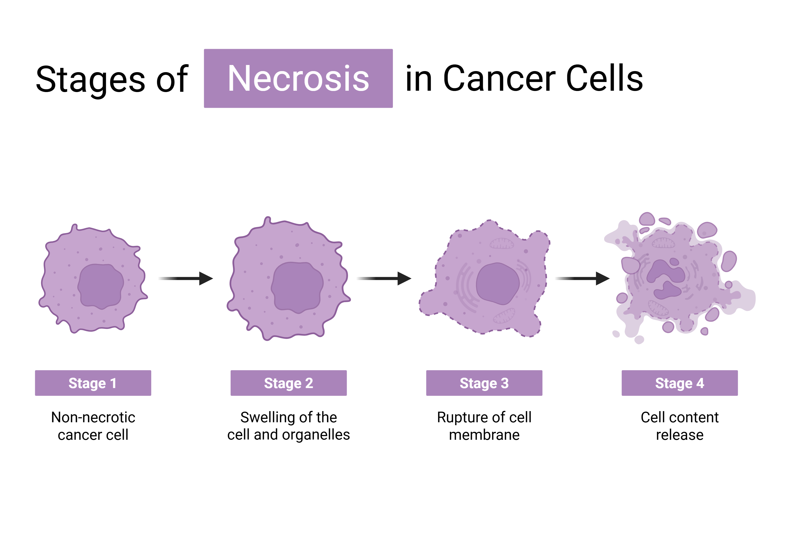
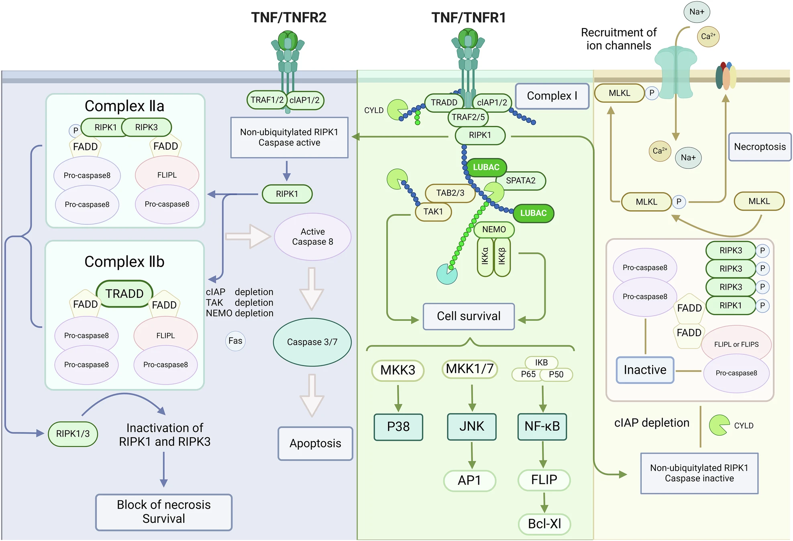

## Perspective

Necroptosis 是读癌症细胞死亡和免疫治疗时很容易混淆的概念。它看起来像 necrosis，因为细胞会肿胀、破裂、释放内容物；但它不是被动坏死，而是一种有分子程序控制的 regulated necrotic cell death。

先记住一个实用边界：**necroptosis 是一种 RIPK1/RIPK3/MLKL 相关的炎症性细胞死亡。它的癌症意义不只是杀死癌细胞，更在于死亡后释放 DAMPs、cytokines 和抗原，可能改变 tumor microenvironment 和抗肿瘤免疫。**

## Definition

Necroptosis is a regulated necrotic cell death pathway mediated mainly by RIPK1, RIPK3, and MLKL. It often occurs when death receptor or innate immune signaling is activated but caspase-8-dependent apoptosis is blocked or insufficient.

中文理解：necroptosis 是“有程序的破裂性死亡”。和 apoptosis 的安静清除不同，necroptosis 更像一个带警报的死亡方式：细胞膜完整性被破坏，细胞内容物释放出来，容易引发炎症和免疫反应。

## Why It Matters

Necroptosis 对癌症重要，是因为它同时连接三个问题：癌细胞死亡、炎症、免疫治疗。

一方面，它可能是 apoptosis 被抑制时的 backup death pathway。癌细胞如果逃过 apoptosis，理论上仍可能被推向 necroptosis。另一方面，necroptosis 的 lytic nature 使它更容易释放 DAMPs 和 tumor antigens，从而激活 dendritic cells、CD8+ T cells 和 immunogenic cell death (ICD)。

但这也是它的风险。炎症不一定抗癌。过强或持续的 necroptosis 可能导致 systemic inflammation、autoimmunity、tumor lysis syndrome，甚至在实体瘤中扩大 necrotic core，形成促转移或免疫抑制的局部环境。

## Core Mechanism

Necroptosis 最经典的入口是 TNF/TNFR1 signaling，但它也可以由 TLR3/4-TRIF、ZBP1 sensing of Z-nucleic acids、STING/IFN-related signals 等路径触发。

**TNF/TNFR1 route**

TNF 结合 TNFR1 后，细胞可以走向 survival、apoptosis 或 necroptosis。结果取决于 RIPK1 的状态、IAP-mediated ubiquitylation、NF-kB survival signaling、caspase-8 活性，以及 RIPK3/MLKL 是否可用。

- 在 survival mode 中，RIPK1 主要作为 scaffold，帮助激活 NF-kB 和 MAPK，促进 pro-survival 和 inflammatory genes。
- 当 survival complex 失稳时，RIPK1 可进入 cytosolic complex II，推动 apoptosis 或 necroptosis。
- 如果 caspase-8 活跃，它会促成 apoptosis，也会切割并限制 RIPK1/RIPK3/CYLD 等 necroptosis components。
- 如果 caspase-8 被抑制或缺失，active RIPK1 更容易招募 RIPK3，形成 necrosome。

**Necrosome and MLKL execution**

RIPK1 和 RIPK3 通过 RHIM-domain interactions 形成 necrosome。RIPK3 激活后磷酸化 MLKL。Phosphorylated MLKL 改变构象、寡聚化，并转移到 plasma membrane，最终导致 ion imbalance、cell swelling 和 plasma membrane rupture。

**Alternative routes**

TLR3/4 可以通过 TRIF 直接招募 RIPK3；ZBP1 可以识别 Z-RNA、Z-DNA 或 mtDNA，并通过 RIPK3 触发 necroptosis。这些路径不一定像 TNFR1 route 那样强依赖 caspase-8 inhibition，但仍受 caspase-8、RIPK1 scaffold function 和 IFN-induced gene expression 调节。

## Key Points

- Necroptosis 是 regulated necrotic cell death，不是普通被动坏死。
- 核心执行轴是 RIPK1-RIPK3-MLKL。
- Caspase-8 是关键刹车：它既能推动 apoptosis，也能限制 necroptosis。
- TNFR1 signaling 可以根据上下文走向 survival、apoptosis 或 necroptosis。
- RIPK1 有双重角色：kinase-active RIPK1 可推动 cell death；scaffold RIPK1 可促进 survival、NF-kB inflammation 和免疫逃逸。
- RIPK3 磷酸化 MLKL 后，MLKL oligomerization 和 membrane targeting 造成 plasma membrane rupture。
- Necroptosis 通常比 apoptosis 更炎症性，因为细胞内容物和 DAMPs 会释放到外部。
- 癌细胞中 RIPK3 promoter hypermethylation 较常见，提示肿瘤可能选择性关闭 necroptosis competence。
- MLKL loss 没有 RIPK3 loss 那么普遍，说明 RIPK3 可能还有 necroptosis 之外的癌症相关功能。
- Necroptosis 可作为 immunogenic cell death，帮助 DC activation、antigen cross-presentation 和 CD8+ T cell response。
- 诱导 necroptosis 也可能带来 systemic inflammation、autoimmunity、tumor lysis syndrome 或促肿瘤炎症。
- 判断 necroptosis 不能只看转录组；更可靠的证据包括 p-MLKL，并且要区分是否同时存在 cleaved caspase-3/7。

## Cancer Context

在癌症里，necroptosis 的核心问题是：癌细胞能不能被推向一种“会报警的死亡”。

如果肿瘤细胞保留 RIPK3 和 MLKL，并且 caspase-8 checkpoint 可被绕开，necroptosis 可能帮助杀死 apoptosis-resistant tumor cells。SMAC mimetics、IAP inhibition、caspase inhibitors、TLR/STING/ZBP1 activation、ADAR1 inhibition、RIPK1 PROTAC 等策略，都可以从不同位置影响这条轴。

但 necroptosis 不是单纯的好事。它释放的炎症信号可能帮助抗肿瘤免疫，也可能形成慢性炎症和免疫抑制环境。实体瘤中的 necrotic core 常和差预后、低氧、营养缺乏、转移相关，因此“诱导 necroptosis”必须具体到时间、位置、细胞类型和免疫状态。

一个实际读法是：necroptosis 更像一种 TME-modifying death program，而不是单纯的 tumor-cell killing program。它是否有益，取决于 dying tumor cells 是否能同时提供 antigenicity、adjuvanticity 和合适的 inflammatory context。

## Therapeutic Logic

可以把 necroptosis-based therapy 的逻辑分成三步：

1. 确认肿瘤还有 necroptosis machinery：RIPK3、MLKL、RIPK1、caspase-8、ISGs 等。
2. 用 IFN-inducing 或 stress-inducing treatment 提高 pathway competence，例如 chemotherapy、radiotherapy、STING agonists、TLR agonists。
3. 在合适窗口解除 brake 或推动 execution，例如 caspase inhibition、IAP/SMAC mimetics、RIPK1 modulation、ZBP1-related activation。

这套逻辑的难点是安全窗口。治疗目标不是让全身组织都发生 necroptotic inflammation，而是让肿瘤局部出现可被免疫系统利用的死亡和炎症。

## Related Concepts

- apoptosis
- pyroptosis
- ferroptosis
- regulated cell death
- immunogenic cell death
- RIPK1
- RIPK3
- MLKL
- necrosome
- caspase-8
- TNF
- TNFR1
- SMAC mimetic
- IAP
- ZBP1
- STING
- ADAR1
- tumor microenvironment

## In Papers

- [Cell Death in Cancer](../../literature/papers/conradCellDeathCancer2026/index.qmd)

## Note

读文献时要特别注意作者是否真的证明了 necroptosis。仅有 RIPK3/MLKL 表达变化不够；p-MLKL 更接近执行证据。还要看是否排除了 apoptosis 或 mixed death，因为 caspase activation、secondary necrosis、pyroptosis 和 necroptosis 在治疗压力下可能交叉出现。

对我来说，necroptosis 最有用的理解是“炎症性死亡开关”：它既可能绕过 apoptosis resistance，又可能把癌细胞死亡转化成免疫事件。但这个开关很危险，打开的位置、强度和时间决定它是抗癌还是促癌。
