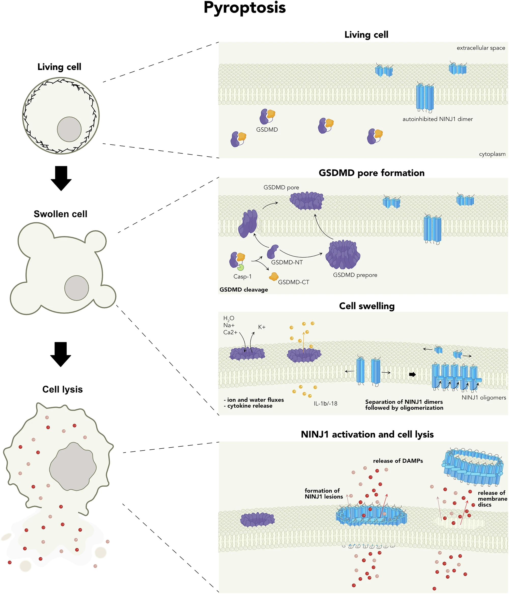
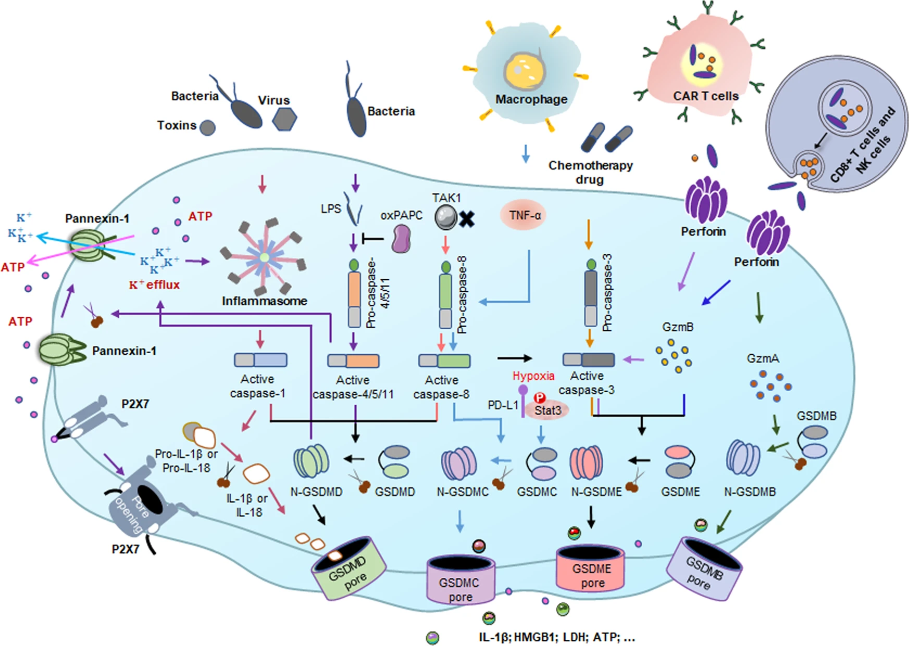

## Perspective

Pyroptosis，中文常译作焦亡，是一种炎症性、裂解性的 programmed cell death。它最早主要和感染、巨噬细胞、inflammasome 放在一起理解；在癌症语境里，重点变成：能否利用 gasdermin-mediated pore formation 把肿瘤细胞死亡转化成强免疫刺激。

先记住一个实用边界：**pyroptosis 的核心不是“细胞死了”，而是 gasdermin 被切开后在膜上打孔，导致细胞肿胀、破裂，并释放 IL-1β、IL-18、DAMPs 和 tumor antigens。**

## Definition

Pyroptosis is a gasdermin-mediated programmed necrotic cell death characterized by membrane pore formation, cell swelling, plasma membrane rupture, and release of pro-inflammatory cytokines and danger signals.

中文理解：焦亡是一种“打孔式炎症死亡”。炎症性 caspases 或其他 proteases 切开 gasdermin，释放 gasdermin 的 N-terminal pore-forming domain。这个片段插入细胞膜形成孔洞，让细胞失去渗透压平衡，最终破裂并释放炎症信号。

## Why It Matters

Pyroptosis 对癌症重要，是因为它可能把 tumor cell killing 和 anti-tumor immunity 连接起来。

如果肿瘤细胞发生 pyroptosis，plasma membrane rupture 可以释放 tumor antigens 和 DAMPs，促进 dendritic cell activation、antigen presentation 和 CD8+ T cell priming。它也可能通过 chemokines、IL-1β、IL-18、IFNγ 相关反应，把原本免疫冷的肿瘤推向更热的炎症环境，从而提高 immune checkpoint blockade 的响应。

但它的风险同样清楚：炎症不是自动抗癌。持续、低水平或位置不合适的 pyroptotic signaling 可能促进 IL-1β-driven chronic inflammation、angiogenesis、MDSC accumulation、cytokine release syndrome 或正常组织损伤。

## Core Mechanism

Pyroptosis 的执行者是 gasdermins，而不是 caspase 本身。Caspases 和 granzymes 的作用更像“剪刀”：它们切开 gasdermin 的 inhibitory C-terminal domain，释放 N-terminal pore-forming domain。

**Canonical inflammasome route**

Danger signals 或 pathogen signals 激活 inflammasome sensors，例如 NLRP3、AIM2、NLRC4、NLRP1、PYRIN 等。这些 sensors 通过 ASC 招募并激活 caspase-1。Caspase-1 随后切割 GSDMD，并加工 pro-IL-1β 和 pro-IL-18。GSDMD N-terminal fragments 在膜上形成孔，释放 IL-1β/IL-18 并诱导 pyroptosis。

**Non-canonical inflammasome route**

在小鼠中，cytosolic LPS 可激活 caspase-11；在人类中，对应的是 caspase-4 和 caspase-5。这些 inflammatory caspases 也可以切割 GSDMD，触发 pore formation 和 pyroptosis。

**Apoptosis-to-pyroptosis switch**

GSDME 是癌症语境里特别重要的 gasdermin。Apoptotic caspase-3/7 可切割 GSDME，使原本较安静的 apoptosis-like stimulus 转向 lytic inflammatory death。这个转换是否发生，取决于细胞是否表达足够 GSDME。

**Cytotoxic lymphocyte route**

CTL 和 NK cells 释放 granzymes。Granzyme B 可直接或间接通过 caspase-3 激活 GSDME；granzyme A 可处理 GSDMB。也就是说，免疫细胞杀伤肿瘤时，除了 perforin/granzyme 和 death receptor apoptosis，也可能通过 gasdermin 让目标细胞发生 pyroptotic killing。

## Key Points

- Pyroptosis 是 gasdermin-mediated programmed necrotic cell death。
- 典型形态是 cell swelling、membrane pore formation、plasma membrane rupture 和 inflammatory content release。
- GSDMD 是 canonical 和 non-canonical inflammasome pyroptosis 的经典执行者。
- Caspase-1 可同时切割 GSDMD、pro-IL-1β 和 pro-IL-18。
- Caspase-4/5/11 可感知 cytosolic LPS 并激活 GSDMD。
- GSDME 可被 caspase-3/7 切割，使 apoptosis stimulus 转向 pyroptosis-like lytic death。
- GSDMB/GSDME 可被 cytotoxic lymphocyte granzymes 激活，参与 CTL/NK-mediated tumor killing。
- Pyroptosis 可以释放 tumor antigens、DAMPs、IL-1β、IL-18 和 chemokines，增强 antigen presentation 和 immune recruitment。
- 肿瘤可通过 GSDME promoter hypermethylation 或 gasdermin isoform switching 逃避 pyroptosis。
- Decitabine 等 demethylating treatment 可能恢复 GSDME 表达，提高 pyroptosis competence。
- 低水平或慢性 pyroptotic signaling 可能促癌，尤其通过 IL-1β-driven inflammation、angiogenesis 或 MDSC-related immunosuppression。
- 判断 pyroptosis 不能只看 cell death 或 caspase activation；需要看 gasdermin cleavage、pore formation、IL-1β/IL-18 release 和 lytic morphology。

## Cancer Context

在癌症中，pyroptosis 最吸引人的地方是它可能把死亡变成免疫事件。肿瘤细胞如果表达合适的 gasdermins，治疗或免疫细胞杀伤可能触发 pyroptosis，释放抗原和炎症信号，促进 DC cross-presentation 和 CD8+ T cell response。

这也解释了为什么很多肿瘤会降低 gasdermin expression。比如 GSDME promoter hypermethylation 可让肿瘤细胞失去从 apoptosis 转向 pyroptosis 的能力；GSDMB 不同 splice isoforms 的 pore-forming capacity 不同，肿瘤可能选择不具备 pyroptosis 功能的 isoforms。

治疗上，pyroptosis 的思路包括：恢复 gasdermin expression，直接激活 gasdermins，用 nanoparticles 或 oncolytic viruses delivery active gasdermin domains，或利用 CAR-T/NK/granzyme pathways 推动肿瘤细胞发生 lytic inflammatory death。

但它的临床风险很直接。Gasdermin activation 如果发生在正常组织或过强发生在肿瘤中，可能造成严重炎症和组织损伤。CAR-T 相关 cytokine release syndrome 也可能和 GSDME-mediated pyroptosis 有关。因此 pyroptosis therapy 的关键词不是“越强越好”，而是 tumor-selective activation。

## Therapeutic Logic

可以把 pyroptosis-based therapy 的逻辑分成三步：

1. 确认肿瘤是否具备 pyroptosis machinery：GSDMD、GSDME、GSDMB isoforms、inflammasome components、caspase-1/3/4/5/8 等。
2. 判断触发路径：inflammasome activation、apoptosis-to-pyroptosis switch、granzyme-mediated activation，还是直接 delivery active gasdermin。
3. 控制炎症范围：让 pyroptosis 发生在 tumor cells 或有利的 TME cell types 中，同时避免正常组织损伤和 systemic cytokine toxicity。

这套逻辑的难点是检测和选择性。很多研究能证明 cell death 或 inflammation，但未必能清楚证明是 gasdermin-dependent pyroptosis。

## Related Concepts

- apoptosis
- necroptosis
- ferroptosis
- regulated cell death
- immunogenic cell death
- inflammasome
- gasdermin
- GSDMD
- GSDME
- GSDMB
- caspase-1
- caspase-3
- IL-1β
- IL-18
- granzyme
- cytotoxic T cell
- NK cell
- tumor microenvironment

## In Papers

- [Cell Death in Cancer](../../literature/papers/conradCellDeathCancer2026/index.qmd)

## Note

读文献时要小心区分 “inflammatory cell death” 和真正的 pyroptosis。Pyroptosis 的关键证据应该落在 gasdermin activation 上，而不是只有 LDH release、PI staining、caspase activity 或 IL-1β 上升。

对我来说，pyroptosis 最有用的理解是“打孔放大器”：它通过 gasdermin pores 把细胞内危险信号、细胞因子和抗原释放出来，把一次细胞死亡放大成 TME 和免疫系统能感知的事件。但放大器不分好坏，放大抗肿瘤免疫的同时，也可能放大促癌炎症和治疗毒性。
