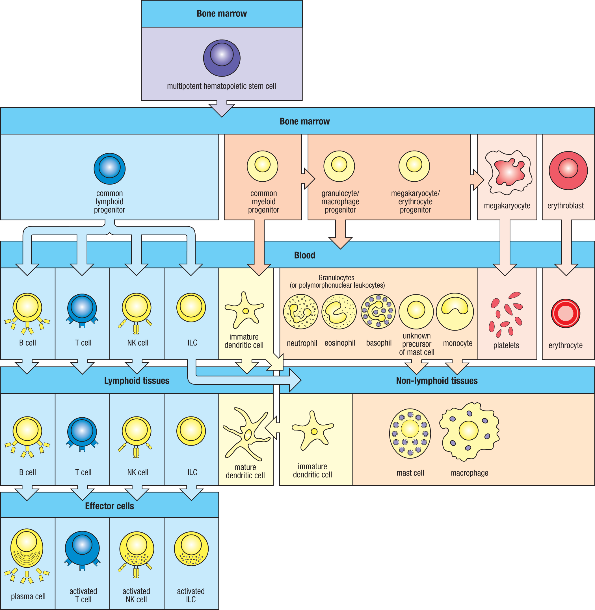

## Perspective

机体通过免疫系统中各种效应细胞和分子的共同作用，抵御病原体及其毒素的侵害。固有免疫应答和适应性免疫应答都依赖白细胞的功能；因此理解免疫系统，首先要理解这些细胞从哪里来、在哪里成熟、如何进入血液和组织，以及在免疫应答中承担什么角色。

免疫细胞不应该只按“innate / adaptive”背一遍。Janeway 的讲法更自然：先从造血开始，再看不同血细胞谱系如何分化，最后再理解它们在骨髓、血液、淋巴组织和非淋巴组织之间的分布与迁移。

## From Hematopoiesis To Immune Cells

个体出生后，血液中的大多数细胞都来自骨髓中的 hematopoietic stem cells (HSCs)。HSCs 能够分化为所有类型的血细胞，因此也被称为 multipotent hematopoietic stem cells。它们产生分化潜力更有限的 progenitors，再分别进入不同谱系，最终形成红细胞、血小板和白细胞。

这里有一个容易被忽略的边界：**并不是所有组织巨噬细胞都简单来自出生后的骨髓单核细胞。** 有些组织驻留 macrophages，尤其是中枢神经系统的小胶质细胞 microglia，在胚胎发育期间起源于 yolk sac 或 fetal liver。它们在出生前就定居于组织中，并在个体生命周期中通过 self-renewal 维持。

因此，“免疫细胞来源于骨髓”是入门时很有用的总原则，但不是所有组织免疫细胞的完整历史。

## Two Main Lineages

从 HSC 往下看，免疫相关细胞大致可以放进两条谱系。

**Lymphoid lineage** 产生 B cells、T cells、NK cells 和 innate lymphoid cells (ILCs)。这些细胞大多和适应性免疫或 innate-like lymphoid immunity 有关。B cells 主要关联 antibody response；T cells 负责细胞免疫、辅助和调控；NK cells 则是固有免疫中的 cytotoxic lymphocytes。

**Myeloid lineage** 产生 granulocytes、monocytes/macrophages、dendritic cells、mast cells，也和 megakaryocytes、platelets、erythrocytes 等血细胞系统相连。髓样细胞往往是固有免疫应答、炎症、吞噬、抗原呈递和组织修复中的核心。

这个二分法只是地图，不是硬边界。Dendritic cells 的来源和状态复杂；macrophages 可以是 monocyte-derived，也可以是 tissue-resident；NK cells 属于 lymphoid lineage，但功能上属于 innate immunity。读文献时要同时看 lineage、function、marker 和 tissue context。

## Bone Marrow, Blood, Lymphoid Tissues

骨髓不仅是造血发生的地方，也是部分免疫细胞发育成熟的地方。B cells 在骨髓中发育；T cell progenitors 虽来自骨髓，但 T cells 的成熟需要 thymus。许多成熟或未成熟的免疫细胞会进入血液循环，再根据 chemokines、adhesion molecules 和组织信号进入 lymphoid tissues 或 peripheral tissues。

血液是运输通道，不是免疫细胞唯一的“居住地”。Neutrophils、monocytes、lymphocytes、platelets 和 erythrocytes 都可以在血液中看到，但很多免疫反应真正发生在组织、淋巴结、脾脏和黏膜相关淋巴组织中。

淋巴系统负责把组织中的 extracellular fluid、抗原和免疫细胞带回循环。Dendritic cells 可以在组织中摄取 antigen，随后迁移到 draining lymph nodes，激活 naive T cells。Lymphocytes 也会在血液、淋巴和 secondary lymphoid organs 之间不断循环，提高遇到特异性 antigen 的机会。

## Effector Cells

免疫细胞成熟后，很多会进一步分化为 effector cells。

B cells 遇到 antigen 并接受帮助后，可以分化为 plasma cells，分泌 antibodies。Antibodies 是适应性免疫的重要效应分子，能中和毒素和病毒、促进 opsonization，并参与 complement activation。

T cells 被激活后可以分化为不同效应状态。CD8+ T cells 可以杀伤 infected cells 或 tumor cells；CD4+ T helper cells 则通过 cytokines 组织其他免疫细胞的反应。TH1、TH2、TH17、Tfh 和 Treg 不是不同“物种”的细胞，而是 CD4+ T cells 在不同刺激和组织环境下形成的功能状态。

NK cells 和 ILCs 也可以形成 activated effector states。NK cells 通过 cytotoxicity 处理 virus-infected cells 和 tumor cells；ILCs 在屏障组织中快速产生 cytokines，参与 type 1、type 2 或 type 3 immunity。

髓样细胞的效应功能更偏向快速反应和组织执行。Neutrophils 进入炎症部位后吞噬、脱颗粒并释放 antimicrobial molecules；macrophages 清除病原体和死亡细胞，同时参与组织修复；mast cells、basophils 和 eosinophils 在 type 2 immunity、过敏和寄生虫防御中尤其重要。

## How To Read This Figure

这张图最重要的不是把每个细胞名字背下来，而是看清楚几个方向：

- HSC 位于骨髓，是出生后多数血细胞的共同来源。
- Lymphoid progenitor 产生 B cells、T cells、NK cells 和 ILCs。
- Myeloid progenitor 产生 granulocytes、monocytes/macrophages、dendritic cells、mast cells，并连接 megakaryocytes/platelets 和 erythrocytes。
- 血液是许多细胞迁移的中间通道。
- Lymphoid tissues 是 B cells、T cells、NK cells、ILCs 和 dendritic cells 相遇、激活和分化的重要场所。
- Non-lymphoid tissues 中存在 macrophages、mast cells、dendritic cells 等组织驻留或迁入细胞。
- Effector cells 是免疫细胞被激活后执行功能的状态，如 plasma cells、activated T cells、activated NK cells 和 activated ILCs。

读单细胞或肿瘤免疫文章时，这张图可以作为第一层地图。看到一个 cluster，不要马上只问“它叫什么细胞”，还要问：它属于哪条谱系？来自血液还是组织？是 naive、activated、memory、exhausted，还是 tissue-resident？它的效应功能是什么？

## Note

免疫细胞的名字经常混合了来源、形态、功能、marker 和组织位置。例如 macrophage 是功能和形态概念，CD8+ T cell 是 marker 概念，Treg 是功能状态，microglia 是组织位置和发育来源共同定义的细胞。理解这些命名层次，比死记细胞表更重要。

对我来说，这一页先作为 immune cell map。以后读到具体概念时，再单独展开：dendritic cells、macrophages、T cells、B cells、NK cells、ILCs、TAMs、Tregs、exhausted T cells 等。

## Sources

- Janeway's Immunobiology
- [Janeway's Immunobiology, NCBI Bookshelf](https://www.ncbi.nlm.nih.gov/books/NBK10757/)
- [The components of the immune system, NCBI Bookshelf](https://www.ncbi.nlm.nih.gov/sites/books/NBK27092/)
