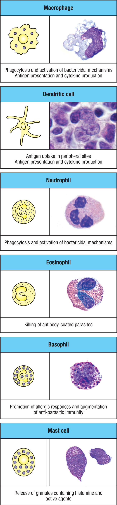

## Perspective

髓系细胞是免疫系统里最重要的“组织执行层”之一。它们通常和 innate immunity、炎症、吞噬、抗原呈递、杀菌、过敏反应、抗寄生虫免疫和组织修复联系在一起。读免疫学或单细胞文章时，myeloid cells 经常不是一个单独细胞类型，而是一组来源和功能相关的细胞集合。

先记住一个实用边界：**myeloid cells 不是 lymphocytes。** 它们大多来自 myeloid lineage，包括 macrophages、dendritic cells、neutrophils、eosinophils、basophils 和 mast cells。它们不依赖 TCR/BCR 做高度特异性识别，但可以快速感知病原体、组织损伤和抗体包被目标，并把局部组织信号转化为炎症或清除反应。

## Definition

Myeloid cells are immune cells derived from the myeloid lineage, including monocytes/macrophages, dendritic cells, granulocytes, and mast cells. They are central to innate immune defense and also help shape adaptive immunity through antigen presentation, cytokine production, and tissue-level inflammation.

中文理解：髓系细胞是一组来自髓样谱系的免疫细胞。它们不像 T cells 和 B cells 那样以 antigen-specific clonal receptors 为核心，而是更偏向快速识别、吞噬、杀菌、释放颗粒、产生 cytokines、呈递抗原和调节组织环境。

## Main Cell Types

**Macrophages** 主要负责 phagocytosis、清除死亡细胞和病原体、产生 cytokines，并参与组织修复。它们可以来自 circulating monocytes，也可以是 embryonic origin 的 tissue-resident macrophages。Macrophage 这个名字更像一个功能和组织状态概念，不只是一个固定 marker。

**Dendritic cells** 是连接 innate immunity 和 adaptive immunity 的关键细胞。它们在外周组织摄取 antigen，迁移到 lymph nodes，向 naive T cells 呈递 antigen，并通过 costimulation 和 cytokines 影响 T cell differentiation。图里把 dendritic cells 的核心功能概括为 antigen uptake、antigen presentation 和 cytokine production。

**Neutrophils** 是急性炎症中非常快速的效应细胞，尤其重要于细菌和真菌感染。它们可以 phagocytose microbes，释放 antimicrobial granules，产生 reactive oxygen species，也可形成 NETs。血液中 neutrophils 数量多，进入组织后通常寿命较短，但杀伤能力强。

**Eosinophils** 常和 helminth infection、allergy、asthma 和 type 2 inflammation 相关。它们的颗粒蛋白可以伤害大型寄生虫，也可能在过敏性炎症中造成组织损伤。图里的重点是 killing of antibody-coated parasites。

**Basophils** 是血液中的颗粒细胞，和 allergic responses、IgE-dependent activation、histamine release 以及 anti-parasitic immunity 有关。它们数量少，但在 type 2 immunity 中可以放大局部炎症和 cytokine signals。

**Mast cells** 主要驻留在组织中，尤其靠近皮肤、黏膜、血管和神经。它们含有 histamine 等颗粒内容物，受到 IgE cross-linking、补体片段或组织损伤信号刺激后可快速 degranulate，引发血管扩张、通透性增加、瘙痒、平滑肌收缩和过敏反应。

## Shared Functions

髓系细胞的共同点不是长得像，而是它们都能把局部环境变化转化成免疫动作。

第一类动作是 **recognition and uptake**。Macrophages、dendritic cells 和 neutrophils 可以通过 pattern-recognition receptors、Fc receptors、complement receptors 等机制识别病原体、死亡细胞或被抗体/补体包被的目标。

第二类动作是 **killing and containment**。Neutrophils 和 macrophages 可以吞噬并杀灭微生物；eosinophils 可以攻击抗体包被的大型寄生虫；mast cells 和 basophils 可以通过释放颗粒和 lipid mediators 改变局部组织环境。

第三类动作是 **communication**。Macrophages、dendritic cells、mast cells 和 granulocytes 都能产生 cytokines、chemokines 或 inflammatory mediators，招募其他免疫细胞，决定炎症强度，并影响 T cell 和 B cell response。

## Myeloid Cells And Adaptive Immunity

髓系细胞虽然常被归入 innate immunity，但它们并不只负责“早期反应”。Dendritic cells 是 naive T cell activation 的核心 antigen-presenting cells；macrophages 可以向 effector T cells 呈递 antigen，并被 IFN-gamma 等信号激活；mast cells、basophils 和 eosinophils 参与 type 2 immunity，和 TH2 cells、IgE、IL-4、IL-5、IL-13 等轴线连接紧密。

因此，myeloid 与 lymphoid 不是互不相干的两套系统。更准确的理解是：lymphoid cells 提供高度特异的识别、记忆和调控，而 myeloid cells 把这些信号落实到组织层面的吞噬、杀伤、炎症、屏障反应和修复。

## How To Read This Figure

这张图把几类主要髓系细胞放在一起，适合作为功能速查图。

- Macrophages: phagocytosis、bactericidal mechanisms、antigen presentation、cytokine production。
- Dendritic cells: antigen uptake in peripheral sites、antigen presentation、cytokine production。
- Neutrophils: phagocytosis 和 bactericidal mechanisms，是急性炎症中的快速杀菌细胞。
- Eosinophils: killing of antibody-coated parasites，常和 type 2 immunity 及 allergy 相关。
- Basophils: promotion of allergic responses and augmentation of anti-parasitic immunity。
- Mast cells: release of granules containing histamine and other active agents，常见于组织过敏反应和屏障部位炎症。

读图时不要只记细胞名字，要同时问三个问题：它在哪里？它识别什么？它通过什么效应机制改变组织环境？

## Key Points

- Myeloid cells 大多属于 innate immune system，但会强烈影响 adaptive immunity。
- Macrophages 和 neutrophils 都能吞噬和杀菌，但 macrophages 更偏组织驻留、清除和修复，neutrophils 更偏急性炎症快速杀伤。
- Dendritic cells 的核心价值是把外周组织中的 antigen 信息带到 lymph nodes，启动 T cell response。
- Eosinophils、basophils 和 mast cells 常和 type 2 immunity、allergy、IgE 和 anti-parasitic immunity 放在一起理解。
- Mast cells 主要是 tissue-resident cells；basophils 主要在血液中循环。
- Granules 不是“装饰性形态”，而是这些细胞快速释放 effector molecules 的功能基础。
- 在 single-cell 数据中，myeloid clusters 的命名要同时看 lineage markers、tissue context、activation state 和 functional genes。

## Note

髓系细胞很容易被过度简化成“先天免疫细胞”。这个说法对入门有用，但不够精确。它们既是早期防御细胞，也是抗原呈递细胞、炎症组织者、过敏反应执行者、寄生虫防御细胞和组织修复参与者。

对我来说，这一页是 immune cell map 的第二层：先知道 lymphoid/myeloid 的大分支，再在 myeloid 里区分 phagocytes、antigen-presenting cells、granulocytes 和 tissue-resident effector cells。

## Sources

- Janeway's Immunobiology
- [Janeway's Immunobiology, NCBI Bookshelf](https://www.ncbi.nlm.nih.gov/books/NBK10757/)
- [The components of the immune system, NCBI Bookshelf](https://www.ncbi.nlm.nih.gov/sites/books/NBK27092/)
