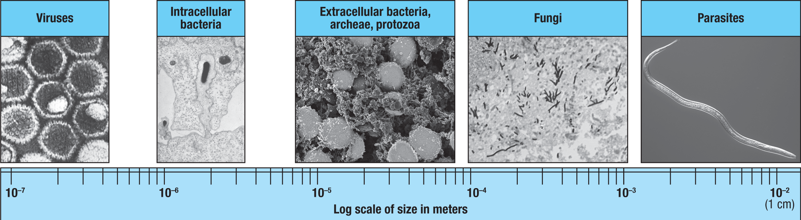

## Perspective

免疫系统不是为了“识别一切外来物”而存在，而是为了在病原体及其毒素造成损伤之前，限制、清除或控制它们。理解免疫应答时，先要理解敌人是什么：病原体有哪些类型、它们在哪里复制、大小差异有多大、以什么方式伤害宿主。

病原体大致可分为几类：viruses、bacteria/archaea、fungi 和 parasites。它们大小不同，生活方式不同，进入宿主组织后的破坏方式也不同。因此，机体对它们的免疫策略也不同。

## Major Classes

**Viruses** 是最小的一类病原体，直径通常从几纳米到几百纳米。病毒不能独立完成复制，必须进入宿主细胞，利用宿主细胞的 machinery 产生新的病毒颗粒。病毒在细胞内复制时，可以诱导细胞裂解，也可以让被感染细胞被免疫系统识别并杀伤。

**Intracellular bacteria** 体积比病毒更大，可以在宿主细胞内生存或复制。一些胞内细菌和分枝杆菌能够直接损伤被感染细胞，也可以通过产生毒素或诱导炎症反应造成组织损伤。因为它们藏在细胞内，免疫系统需要依赖细胞介导的机制来控制感染。

**Extracellular bacteria, archaea, and protozoa** 多位于细胞外空间、黏膜表面、血液或组织间隙。细胞外致病菌可以释放 toxins，也可以触发强烈炎症反应。严重时，毒素和炎症介质进入血液，可导致 sepsis、shock 和广泛组织损伤。

**Fungi** 可以作为细胞外或组织内病原体存在。真菌的细胞壁结构和生长方式使它们需要特定的先天免疫识别机制。对真菌的防御常涉及 neutrophils、macrophages、dendritic cells、TH17 responses 和屏障组织免疫。

**Parasites** 是体积最大的病原体类别之一，尤其是 helminths。大型寄生虫通常无法像病毒那样感染宿主细胞并在其中复制，但它们可以迁移到组织中、形成囊肿、释放分泌产物，并诱导强烈的 type 2 immunity。宿主组织损伤有时来自寄生虫本身，有时来自免疫反应。

## Size And Location Matter

病原体大小不是单纯的形态知识，它会影响免疫系统能采用的策略。

病毒和部分细菌位于细胞内，抗体很难直接接触到正在复制的病原体。因此，机体需要 interferons、NK cells、CD8+ T cells、macrophage activation 等细胞内防御机制。

细胞外细菌和真菌暴露在组织液、血液或黏膜表面，抗体、complement、phagocytes 和 antimicrobial peptides 可以直接作用于它们。这里的关键问题常常是如何快速限制扩散，同时避免炎症反应过度造成组织损伤。

蠕虫等大型寄生虫太大，不能简单被一个吞噬细胞吞掉。机体更常使用 barrier responses、eosinophils、mast cells、IgE、mucus production 和 tissue remodeling 等方式限制它们、驱逐它们，或把它们包围在组织中。

## Damage Defines Pathogenicity

并非所有微生物都是病原体。皮肤、口腔黏膜、结膜、胃肠道等部位定植着大量 bacteria、archaea 和 fungi。它们与宿主保持共生关系，通常不伤害宿主，甚至帮助宿主维持代谢、屏障和免疫稳态。

因此，commensal microbes 和 pathogens 的区别不只是“外来”还是“自身”，而是它们是否造成宿主损伤，以及是否突破了正常的组织边界。

肠道是最好的例子。肠腔中含有大量微生物，但它们被 mucus layer、epithelial barrier、antimicrobial peptides 和局部免疫机制限制在合适的位置。只要这个空间关系维持住，共生微生物就可以和宿主和平共处。相反，致病菌可以穿透屏障，损伤肠上皮细胞，并扩散到下层组织，引发炎症和疾病。

## How To Read This Figure

这张图把不同病原体放在同一个 log scale of size 上。它提醒我几件事：

- Viruses 最小，通常是 intracellular pathogens。
- Intracellular bacteria 比病毒大，但仍以细胞内生存为重要特征。
- Extracellular bacteria、archaea、protozoa 和 fungi 处于更大的尺度，常与细胞外空间和组织炎症相关。
- Parasites 尤其是 helminths 可接近毫米到厘米级别，免疫系统无法简单用吞噬方式处理。
- 病原体的大小、位置和生活方式决定了免疫防御策略。

读免疫学文章时，先问病原体在哪里：在细胞内、细胞外、黏膜表面、血液中，还是组织中。这个问题通常比直接背“抗病毒靠什么、抗细菌靠什么”更有用。

## Note

病原体和共生微生物之间没有一条只按物种划分的绝对界线。同一种微生物在合适位置可能是 commensal，进入错误组织或宿主免疫状态改变时可能成为 opportunistic pathogen。免疫系统真正要解决的是：在保护屏障和共生关系的同时，识别并控制会造成损伤的入侵或失衡。

## Sources

- Janeway's Immunobiology
- [Janeway's Immunobiology, NCBI Bookshelf](https://www.ncbi.nlm.nih.gov/books/NBK10757/)
- [The components of the immune system, NCBI Bookshelf](https://www.ncbi.nlm.nih.gov/sites/books/NBK27092/)
